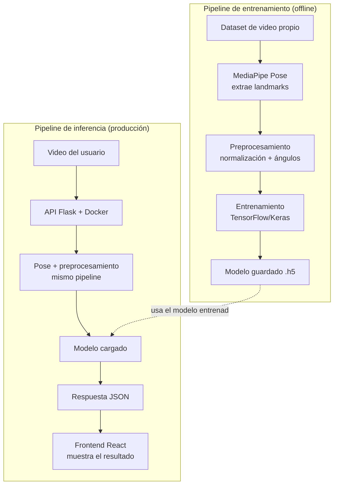

# Analizador de Técnica — Tenis de Mesa


Sistema de visión por computador que analiza la técnica del **drive** y el **revés** en tenis de mesa a partir de un video subido o grbado, usando estimación de pose (MediaPipe) y un modelo de deep learning (TensorFlow) entrenado con un dataset propio, grabado y etiquetado por mí mismo.

## Por qué existe este proyecto

Jugué tenis de mesa competitivamente durante buena parte de mi niñez y adolecencia. Al cursar una especialización en Inteligencia Artificial, quise construir algo que combinara ambas cosas: aplicar visión por computador y deep learning a un problema donde mi criterio como jugador realmente importa en donde defini qué hace que un golpe sea técnicamente correcto o no, y enseñarle eso a un modelo.

## Qué hace

1. El usuario sube un video (o graba directo con su cámara) ejecutando un drive o un revés.
2. El sistema extrae los puntos clave del cuerpo con MediaPipe Pose.
3. Calcula ángulos articulares (codo, cadera, altura de muñeca) definidos a partir de criterios técnicos reales de tenis de mesa.
4. Un modelo de red neuronal, entrenado con un dataset propio de ~71 repeticiones grabadas y etiquetadas manualmente, predice si la ejecución fue **correcta** o **incorrecta**, con un nivel de confianza.

## Arquitectura

Dos flujos separados: uno de entrenamiento (offline) y uno de inferencia (el que corre cuando alguien usa la app).



## Stack tecnológico

| Categoría | Tecnologías |
|---|---|
| Visión por computador | MediaPipe Pose, OpenCV |
| Machine Learning | TensorFlow/Keras, scikit-learn |
| Backend | Python, Flask, Flask-CORS |
| Frontend | React, Vite |
| Testing | pytest |
| CI/CD | GitHub Actions |
| Contenedores | Docker |
| Control de versiones | Git, GitHub |

## Dataset

Fue un dataset grabado y etiquetado a mano, con una clasificación automática de repeticiones por velocidad de movimiento de la muñeca:

| Categoría | Repeticiones |
|---|---|
| Drive correcto | 23 |
| Drive incorrecto | 16 |
| Revés correcto | 20 |
| Revés incorrecto | 12 |
| **Total** | **71** |

## Resultados

Se validó con **5-fold cross-validation** (no un solo entrenamiento, para evitar resultados optimistas por azar):

| Golpe | Accuracy promedio |
|---|---|
| Drive | 74% ± 13% |
| Revés | 76% ± 15% |

Ambos resultados se mantienen consistentemente por encima del 50% (azar en clasificación binaria), confirmando que el modelo captura una señal real — aunque con la variabilidad esperable de un dataset pequeño y propio.

## Limitaciones conocidas

Documentadas con honestidad:

- **Dataset pequeño** (71 repeticiones): suficiente para validar el enfoque, insuficiente para producción real.
- **Sensibilidad fuera de distribución (OOD)**: el modelo asume que el usuario selecciona correctamente qué golpe está ejecutando. Si se le pide evaluar un revés como si fuera un drive, puede responder con alta confianza de forma incorrecta — una limitación conocida de los clasificadores binarios entrenados sin una clase de "rechazo".
- **Sensibilidad al ángulo de cámara**: el dataset se grabó desde un único ángulo lateral. Videos desde ángulos muy distintos (frontal, cámara de laptop) pueden degradar la precisión.

**Próxima fase planeada:** ampliar el dataset con múltiples ángulos de cámara y rediseñar el pipeline en dos etapas (1. identificar qué golpe es, 2. evaluar si fue correcto), resolviendo el problema de OOD desde la raíz.

## Cómo correrlo localmente

### Backend

```bash
cd analizador-tenis-de-mesa
python -m venv venv
venv\Scripts\activate          # Windows
pip install -r requirements.txt
python app.py
```

La API queda disponible en `http://127.0.0.1:5000`.

### Frontend

```bash
cd frontend
npm install
npm run dev
```

La interfaz queda disponible en `http://localhost:5173`.

### Tests

```bash
pytest test_features.py -v
```

## Estructura del repositorio

```
analizador-tenis-de-mesa/
├── app.py                     # API Flask
├── features.py                # Extracción de ángulos/features (con tests)
├── test_features.py           # Tests unitarios (pytest)
├── entrenar_drive.py          # Entrenamiento + evaluación del modelo de drive
├── entrenar_reves.py          # Entrenamiento + evaluación del modelo de revés
├── entrenar_final.py          # Modelos finales de producción (100% del dataset)
├── evaluar_cruzado.py         # Validación cruzada (5-fold)
├── requirements.txt
├── dataset/                   # Repeticiones segmentadas (.npy)
│   ├── drive/{correcto,incorrecto}/
│   └── reves/{correcto,incorrecto}/
├── documentacion/
│   └── criterios-tecnicos-golpes.md   # Documento de diseño técnico completo
├── .github/workflows/tests.yml        # CI/CD
└── frontend/                  # Interfaz en React
    └── src/
```

## Documentación técnica completa

El razonamiento detallado detrás de cada decisión técnica (criterios de golpes, arquitectura, calibración del dataset, bugs reales resueltos) está en [`documentacion/criterios-tecnicos-golpes.md`](documentacion/criterios-tecnicos-golpes.md).

## Autor

**Joan Sebastian Sanchez Acuña** — Ingeniero de Sistemas y Computación | Especialización en IA
[GitHub](https://github.com/Sebastian21sa)
